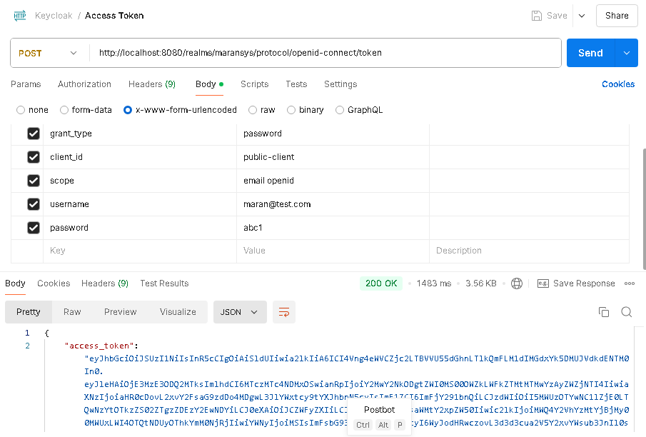
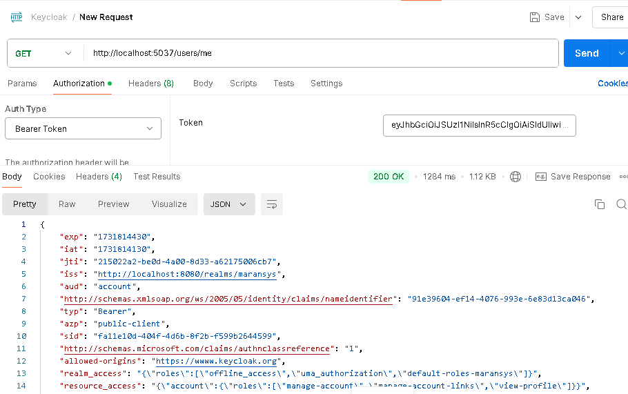
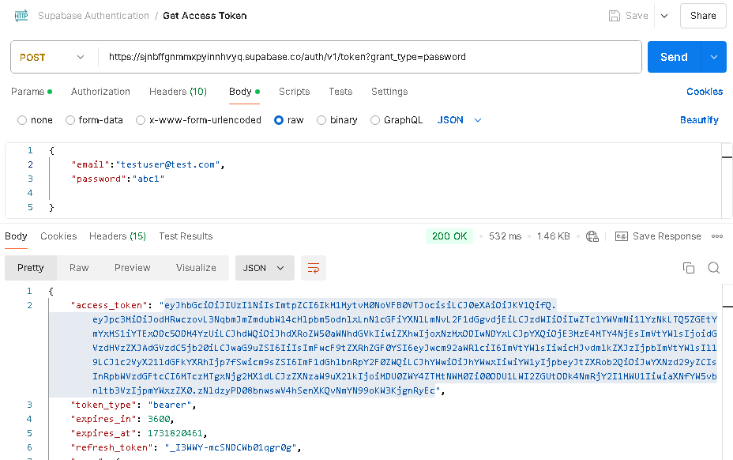
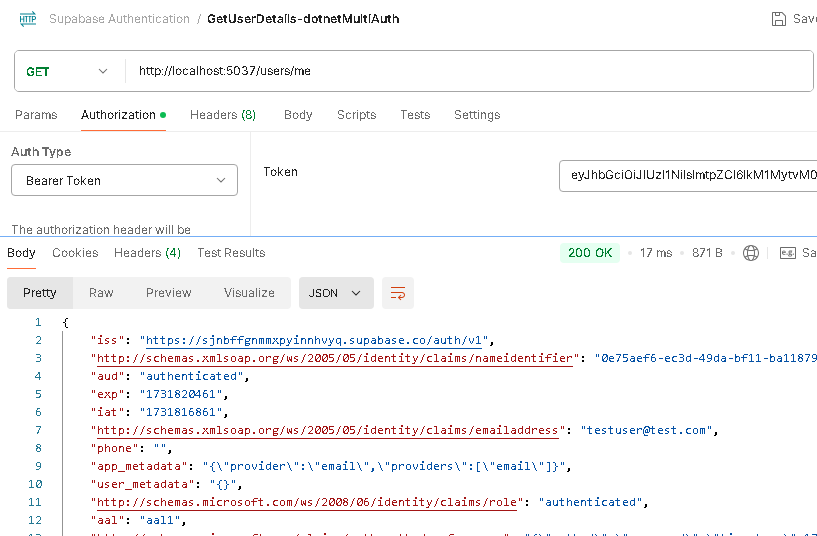
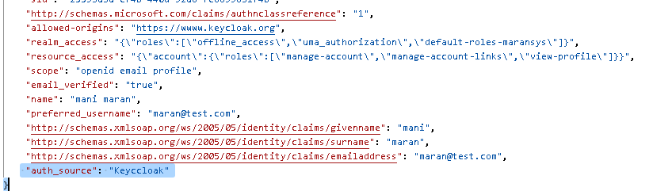
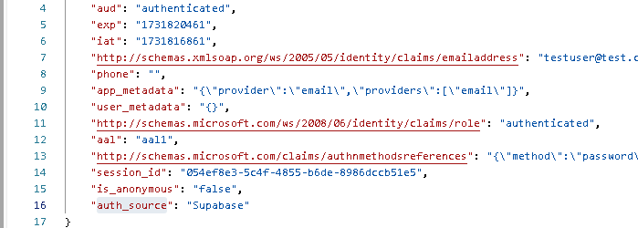

# Multi JWT Auth to a single .net Web API
This .net project uses multiple jwt token for authentication in the same web api poject. Uses from any of the below two providers can login to the app and access the endpoints.

  1. Keycloak Authentication
  2. Supabase Authetication  
 
**Install the packages**:

- Microsoft.AspNetCore.Authentication.JwtBearer
  

**Get Keycloak Jwt using Postman**

 

**KeyCloak authentication in .Net app with Access Token**

**Get Supabase Token using Postman**

**Supbase authentication in .Net app with Token**

**Adding Custom Claim to have the Source provider information**

